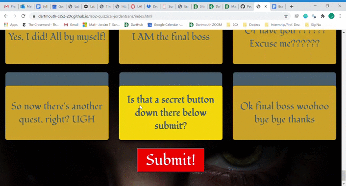
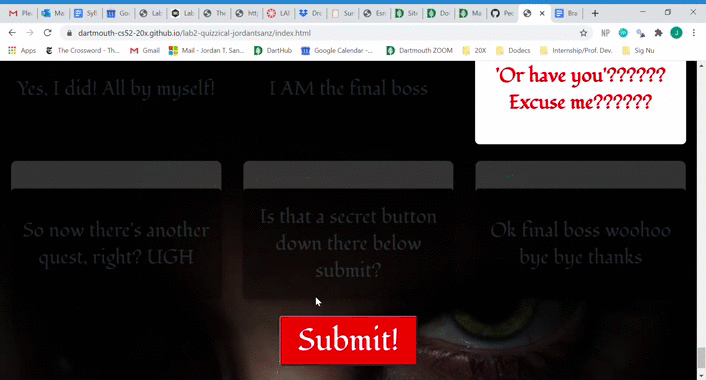

# Lab 2 - Adventure Quiz: What Adventure Character Archetype Are You? 

*This is my Quiz website for Lab 2! It is adventure-themed: it's a quiz that finds your adventure archetype, but there's also a hidden quest to defeat a hidden dragon and become the archetypal hero!*

[Adventure Quiz](https://dartmouth-cs52-20x.github.io/lab2-quizzical-jordantsanz/index.html)

## What Worked Well
Learning jQuery took a bit, but I eventually got the hang of it. It was hard doing the .hide()/.show() while also trying to put animations on my modals, but then I figured out a work-around. The auto-scroll from jQuery was really helpful and made everything run very smoothly, and putting only the containers as "display: none" and then changing the displays of those to show the things inside of them was helpful for transitions and ease. Clicking the questions was easy, and making everything change colors around it was also nice and worked well.

## What Didn't
It was difficult to use the .css() function in jQuery, because I didn't feel like I had all of my css in one place anymore, which was frustrating. It feels a bit more cluttered, and if I wanted to change an effect from red to blue, for instance, I'd have to find it in a couple different spots in my jQuery, instead of changing it once in my css file. I also couldn't figure out how to make backgrounds fade into different images, so that was difficult.

## Extra Credit
Here's a list of the extra-credit I implemented:
 - the score is calculated with multiple weights
 - all of the text/images are read in through json and jquery
 - auto-scroll from each question after clicking
 - fade-in text on background section depending on scroll
 - all questions fade in and are animated; choices fade-in one by one with timeout loop delay
 - mobile format works on iPhone 6/7/8 plus
 - modals are animated to have text pop up when haven't filled out, and retry button fades in when getting an answer
 - scroll up to top when finished with the quiz
 - the SECRET HERO ADVENTURE (hover over the secret button below submit to find it)
 

## Screenshots

*Here is my title fading in on refresh, with the background text fading in on scroll*

*Here is an example of my question title and choices fading-in on scroll, and then auto-scroll taking over once a choice is clicked*

 
*Here is an example of clicking the submit button with not all of the answers selected, making a pop-up come up with needing to choose all of the answers, then that pop-up disappearing automatically*

*Here is an example of getting one of the 8 popups, with the retry button then fading in after a couple moments*

*Here is the secret hero adventure! You must first find the hidden button, then click on it once to prompt text. Click again, and the questions all start shaking because something bad is about to happen...click one more time and you're transported to the evil dragon! With a firey animated overlay, you must answer three questions correctly to defeat the dragon and be named the hero.*

Jordan
